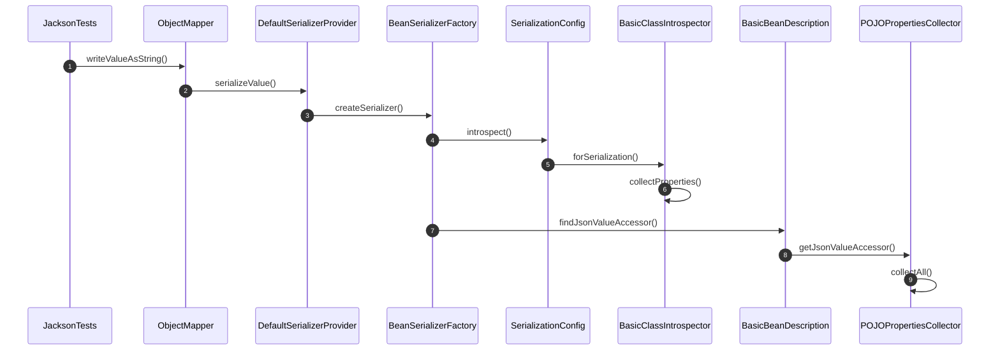
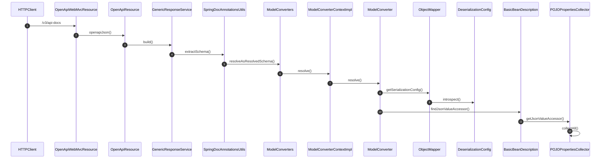

在使用 Jackson 序列化对象时可以使用 `@JsonPropertyOrder` 注解、`@JsonProperty` 注解，`MapperFeature` 枚举中 `SORT_PROPERTIES_ALPHABETICALLY`、`SORT_CREATOR_PROPERTIES_FIRST` 和 `SORT_CREATOR_PROPERTIES_BY_DECLARATION_ORDER` 枚举值来控制字段的输出顺序。如果没有通过这些方式控制字段的输出顺序，则输出的结果与对象中的字段的定义顺序有关。那么排序的过程是怎样的呢？下面来看一看。

<!-- more -->

## 测试用例

我们通过如下的测试用例来演示 Jackson 的排序过程。首先会定义一个实体类 `Person`，它包含了 `@JsonPropertyOrder` 注解、`@JsonProperty` 注解。

```java
import com.fasterxml.jackson.annotation.JsonProperty;
import com.fasterxml.jackson.annotation.JsonPropertyOrder;
import lombok.AllArgsConstructor;
import lombok.Data;
import lombok.NoArgsConstructor;

@Data
@NoArgsConstructor
@AllArgsConstructor
@JsonPropertyOrder(value = {"name", "age", "gender"}, alphabetic = true)
public class Person {
    private String name;

    private Integer gender;

    private int age;

    private Double height;

    @JsonProperty(index = 1)
    private Double weight;

    private String address;

    private String phone;

    @JsonProperty(index = 2)
    private String email;
}
```

接下来是测试类。为了保持简单没有为 `ObjectMapper` 配置 `MapperFeature` 相关的属性。

```java
import com.fasterxml.jackson.core.JsonProcessingException;
import com.fasterxml.jackson.databind.ObjectMapper;

public class JacksonTests {
    public static void main(String[] args) throws JsonProcessingException {
        Person person = new Person("Bob", 1, 18, 170.5, 60.5, "中国", "13123456789", "bob@example.com");
        ObjectMapper mapper = new ObjectMapper();
        System.out.println(mapper.writeValueAsString(person));
    }
}
```

上面的测试用例将输出如下的结果，为了便于查看，输出的结果经过了格式化。

```json
{
    "name": "Bob",
    "age": 18,
    "gender": 1,
    "weight": 60.5,
    "email": "bob@example.com",
    "address": "中国",
    "height": 170.5,
    "phone": "13123456789"
}
```

## 排序过程

与字段排序有关的方法调用过程如下图所示



在这个调用过程中我们需要关注第 ⑥ 步和第 ⑨ 步。第 ⑥ 步的 `BasicClassIntrospector#collectProperties` 方法会创建一个 `POJOPropertiesCollector` 对象，这个对象将作为第 ⑤ 步创建 `BasicBeanDescription` 对象的参数。

第 ⑨ 步的 `POJOPropertiesCollector#collectAll` 方法会

1. 调用 `POJOPropertiesCollector#_addFields` 方法，这个方法通过反射的方式把类的字段添加到 `props` 变量中。此时 `props` 变量中字段的顺序就是在定义类时定义的字段的顺序，如下图中左边灰色部分字段的顺序。
2. 调用 `POJOPropertiesCollector#_sortProperties` 方法，这个方法对 `props` 变量中的字段进行排序。



`_sortProperties` 方法对字段的排序分为如下几步

1. 从 `@JsonPropertyOrder` 注解中解析 `alphabetic` 属性的值，然后解析是否设置了 `SORT_PROPERTIES_ALPHABETICALLY`，根据这两个值来决定是否使用字典排序。
2. 看是否有任意一个字段有 `@JsonProperty` 注解且 `index` 属性有值，如果是则使用下标排序。
3. 定义一个类型为 `LinkedHashMap` 的变量 `ordered` 来保存排序的结果。
4. 首先，将 `@JsonPropertyOrder` 注解的 `value` 属性中明确定义顺序的字段加入 `ordered` 中。如上图中红色部分字段的顺序。
5. 其次，如果需要使用下标排序，则将所有指定了下标的字段按下标从小到大的顺序加入 `ordered` 中。如上图中黄色部分字段的顺序。
6. 然后，如果有创建者字段（即通过构造器设置的字段），同时不使用字典排序（第 1 步）或者配置了 `SORT_CREATOR_PROPERTIES_FIRST`，则根据是否使用字典排序（第 1 步）和是否配置了 `SORT_CREATOR_PROPERTIES_BY_DECLARATION_ORDER` 决定按照字典顺序或按照声明顺序排序创建者字段。在这个例子中不涉及。
7. 最后，根据是否使用字典排序（第 1 步）将剩余的字段按字典顺序或则者声明顺序排序后加入 `ordered` 中。如上图绿色部分字段的顺序。

以上就是 Jackson 在序列化是对字段的排序过程。

## SpringDoc 字段排序过程

[SpringDoc](https://springdoc.org) 在底层依赖了 Jackson 并使用上述排序过程。其中的一条调用链路（简化过）如下图所示



从调用链路第 ⑧ 步开始的逻辑与 Jackson 序列化对象的逻辑几乎一样，因此我们可以在实体类中配置 `@JsonPropertyOrder` 或 `@JsonProperty` 相关的属性值实现对 SpringDoc 字段显示顺序的控制。
