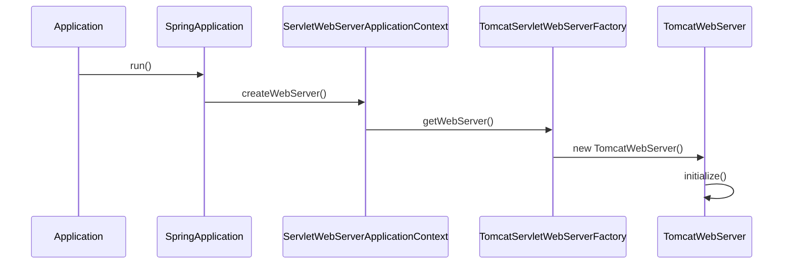
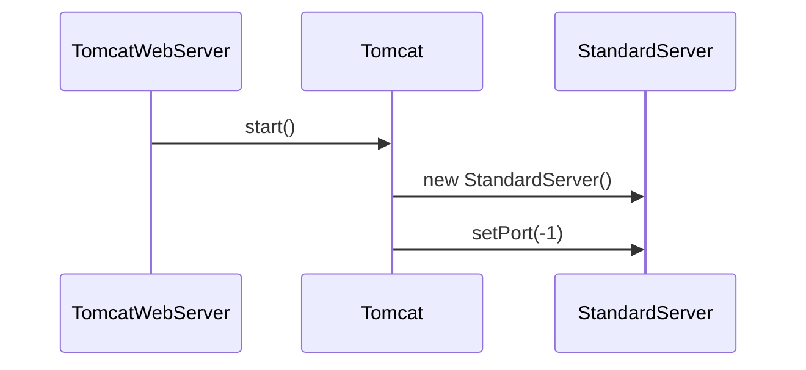

在 Java 语言中，当一个程序所有可能的语句都执行完成后程序就会自动退出。也可以调用 `System#exit` 和 `Runtime#exit` 方法提前退出当前程序。

```java
public class Application {
    public static void main(String[] args) {
        // System.exit(0);
        // Runtime.getRuntime().exit(0);
        System.out.println("Hello World!");
    }
}
```

但是对一个 Spring Boot 应用程序来说，当所有可能的语句执行完成后程序却不会自动退出，这是为什么呢？

```java
import org.springframework.boot.SpringApplication;
import org.springframework.boot.autoconfigure.SpringBootApplication;

@SpringBootApplication
public class Application {
    public static void main(String[] args) {
        SpringApplication.run(Application.class, args);
    }
}
```

<!-- more -->

## 原理分析

下图是与这个问题有关的简化后的调用流程图



在 `TomcatWebServer` 的 `initialize` 方法的最后会调用 `startDaemonAwaitThread` 方法

```java
// Unlike Jetty, all Tomcat threads are daemon threads. We create a
// blocking non-daemon to stop immediate shutdown
startDaemonAwaitThread();
```

从代码的注释可以看出 `startDaemonAwaitThread` 方法会创建一个阻塞的非守护线程来阻止程序立即退出。在这个线程中会调用 `StandardServer` 的 `await` 方法

```java
/**
 * Wait until a proper shutdown command is received, then return. This keeps the main thread alive - the thread pool
 * listening for http connections is daemon threads.
 */
@Override
public void await() {
    // 省略了...
    if (getPortWithOffset() == -1) {
        try {
            awaitThread = currentThread;
            while (!stopAwait) {
                try {
                    Thread.sleep(10000);
                } catch (InterruptedException ex) {
                    // continue and check the flag
                }
            }
        } finally {
            awaitThread = null;
        }
        return;
    }
    // 省略了...
}
```

在这个方法中会每隔 10 秒钟检测一次 `stopAwait` 属性是否为 `true`，如果为 `true` 则会立即退出循环，从而结束非守护线程。

`await` 方法有三个分支，具体执行那个分支依赖 `getPortWithOffset()` 方法的结果

```java
public int getPortWithOffset() {
    // Non-positive port values have special meanings and the offset should
    // not apply.
    int port = getPort();
    if (port > 0) {
        return port + getPortOffset();
    } else {
        return port;
    }
}
```

`StandardServer` 中 `port` 属性的默认值为 `8005`，而 `getPortWithOffset()` 方法的结果为 `-1`，这是又是为什么呢？



在 `TomcatWebServer` 的 `initialize` 方法调用 `startDaemonAwaitThread` 方法之前会调用 `Tomcat` 的 `start` 方法，在这个方法里会创建 `StandardServer` 对象并将它的 `port` 属性设置为 `-1`。这样在调用 `await` 方法是才能进入循环检测 `stopAwait` 属性是否为 `true` 的分支中。

因此 Spring Boot 应用程序是利用了“当所有的非 *daemon* 线程结束时 *JVM* 进程才会终止”这一特性来实现在 `main` 方法结束时进程不会退出。

## 使用 SHUTDOWN 命令

在 `await` 方法中如果 `getPortWithOffset()` 方法返回的值既不是 `-2` 也不是 `-1`，则会在 `8005`（默认值）端口启动一个服务器。在 Windows 下使用命令 `netstat -aon | findstr LISTENING | findstr :80*` 查看 Tomcat 开启了哪些端口

```text
  TCP    0.0.0.0:8080           0.0.0.0:0              LISTENING       49588
  TCP    127.0.0.1:8005         0.0.0.0:0              LISTENING       49588
  TCP    [::]:8080              [::]:0                 LISTENING       49588
```

当客户端连接 `8005` 端口并发送 `SHUTDOWN` 命令时也会使非守护线程结束运行，从而终止 Tomcat 进程。

```java
import java.io.IOException;
import java.io.OutputStream;
import java.net.Socket;
import java.nio.charset.StandardCharsets;

public class Client {
    public static void main(String[] args) throws IOException {
        Socket socket = new Socket("127.0.0.1", 8005);

        OutputStream writer = socket.getOutputStream();
        writer.write("SHUTDOWN".getBytes(StandardCharsets.UTF_8));
        writer.flush();

        writer.close();
        socket.close();
    }
}
```

从前面的分析可以知道 `getPortWithOffset()` 会返回 `-1`，所以这种方式只对使用传统方式启动的 [Tomcat](https://tomcat.apache.org) 有效，对 Spring Boot 应用无效。

这种方式是利用了“`ServerSocket` 的 `accept` 方法会一直阻塞，直到有 `Socket` 连接进来”这一特性来实现在 `main` 方法结束时进程不会退出。

## 参考资料

1. [科普：为什么SpringBoot中main方法执行完毕后程序不会直接退出呢](https://mp.weixin.qq.com/s/777FGb5-IeiALlqh_ny2eg)
2. [【Tomcat】浅聊Tomcat服务的8005端口](https://blog.csdn.net/cnskylee/article/details/124005725)
