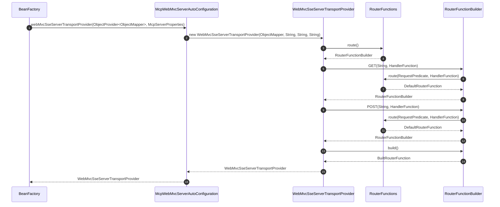
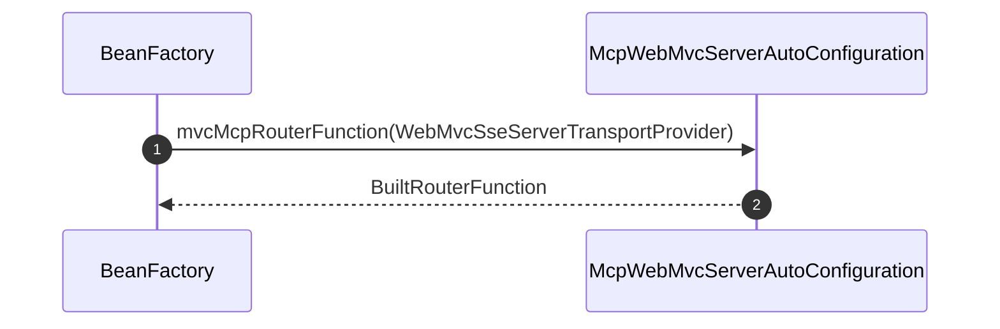
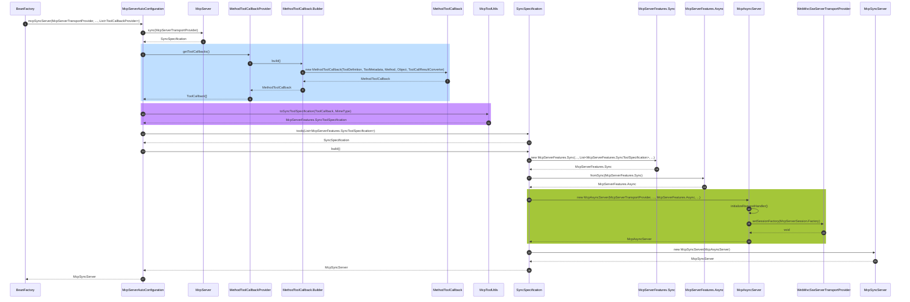
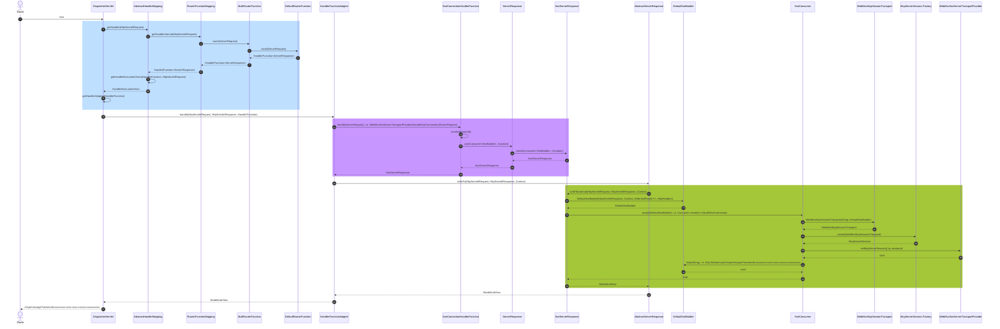
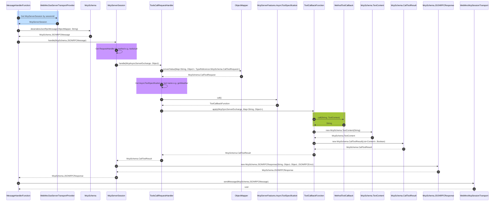
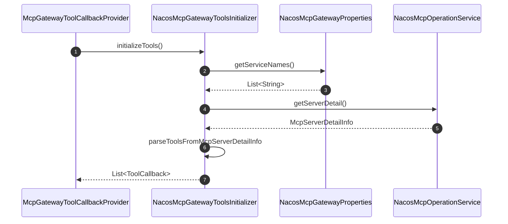
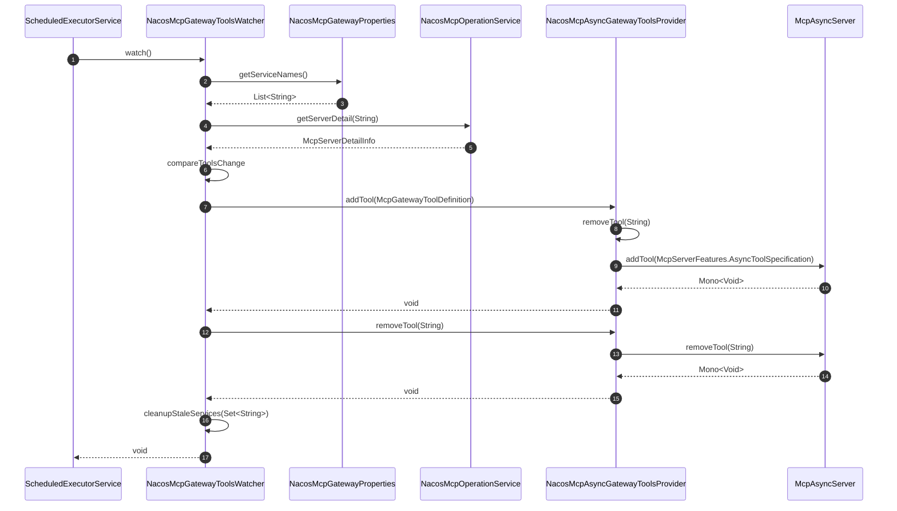

创建一个最简 Spring AI 项目，只引入 `spring-ai-starter-mcp-server-webmvc` 依赖，版本为 1.0.1，`spring.ai.mcp.server.type` 配置为 `SYNC`，然后定义一个 MCP 工具，准备工作就完成了

```java
@Service
public class WeatherService {
    @Tool(description = "Get weather information by city name")
    public String getWeather(String cityName) {
        // Implementation
    }
}

@Configuration
public class McpServerConfiguration {
    @Bean
    public ToolCallbackProvider weatherTools(WeatherService weatherService) {
        return MethodToolCallbackProvider.builder().toolObjects(weatherService).build();
    }
}
```

后续分析只关注与工具调用相关的源码。

<!-- more -->

## MCP 传输层

实现类为 `WebMvcSseServerTransportProvider`，在 `McpWebMvcServerAutoConfiguration` 自动配置，调用的构造器如下所示

```java
public WebMvcSseServerTransportProvider(ObjectMapper objectMapper, String baseUrl, String messageEndpoint, String sseEndpoint) {
    // 省略了...
    this.objectMapper = objectMapper;
    this.baseUrl = baseUrl;
    this.messageEndpoint = messageEndpoint;
    this.sseEndpoint = sseEndpoint;
    this.routerFunction = RouterFunctions.route()
        .GET(this.sseEndpoint, this::handleSseConnection)
        .POST(this.messageEndpoint, this::handleMessage)
        .build();
}
```

`messageEndpoint` 默认为 `/mcp/message，sseEndpoint` 默认为 `/sse`，第 7~10 行构建这两个端点的处理器



第 3\~14 步对应上面代码的第 7\~10 行。

## MCP 处理器映射

`McpWebMvcServerAutoConfiguration` 自动配置创建 `RouterFunction`，实际类型为 `BuiltRouterFunction`



`RouterFunctionMapping` 在实例化后会从 `BeanFactory` 中获取所有的 `RouterFunction` 对象，其中就包括 `BuiltRouterFunction`



```java
private void initRouterFunctions() {
    List<RouterFunction<?>> routerFunctions = obtainApplicationContext()
            .getBeanProvider(RouterFunction.class)
            .orderedStream()
            .map(router -> (RouterFunction<?>) router)
            .collect(Collectors.toList());

    ApplicationContext parentContext = obtainApplicationContext().getParent();
    if (parentContext != null && !this.detectHandlerFunctionsInAncestorContexts) {
        parentContext.getBeanProvider(RouterFunction.class).stream().forEach(routerFunctions::remove);
    }

    this.routerFunction = routerFunctions.stream().reduce(RouterFunction::andOther).orElse(null);
    logRouterFunctions(routerFunctions);
}
```

## MCP 服务器

实现类为 `McpSyncServer`，在 `McpServerAutoConfiguration` 自动配置



`McpToolUtils#toSyncToolSpecification` 方法返回 `McpServerFeatures.SyncToolSpecification`，后者的第二个参数实现了工具调用逻辑：1、转换请求参数；2、调用工具回调方法；3、包装响应结果。

```java
public static McpServerFeatures.SyncToolSpecification toSyncToolSpecification(ToolCallback toolCallback, MimeType mimeType) {
    var tool = new McpSchema.Tool(toolCallback.getToolDefinition().name(), toolCallback.getToolDefinition().description(), toolCallback.getToolDefinition().inputSchema());

    return new McpServerFeatures.SyncToolSpecification(tool, (exchange, request) -> {
        try {
            String callResult = toolCallback.call(ModelOptionsUtils.toJsonString(request), new ToolContext(Map.of(TOOL_CONTEXT_MCP_EXCHANGE_KEY, exchange)));
            if (mimeType != null && mimeType.toString().startsWith("image")) {
                return new McpSchema.CallToolResult(List.of(new McpSchema.ImageContent(List.of(Role.ASSISTANT), null, callResult, mimeType.toString())), false);
            }
            return new McpSchema.CallToolResult(List.of(new McpSchema.TextContent(callResult)), false);
        } catch (Exception e) {
            return new McpSchema.CallToolResult(List.of(new McpSchema.TextContent(e.getMessage())), true);
        }
    });
}
```

在 `McpAsyncServer` 构造器中会初始化请求处理器 `McpServerSession.RequestHandler`，如第 9~10 行所示，在上图使用 `initializeRequestHandler` 表示；同时为 `WebMvcSseServerTransportProvider` 设置会话工厂 `McpServerSession.Factory`，如第 13 行所示

```java
McpAsyncServer(McpServerTransportProvider mcpTransportProvider, ObjectMapper objectMapper, McpServerFeatures.Async features, Duration requestTimeout, McpUriTemplateManagerFactory uriTemplateManagerFactory) {
    this.mcpTransportProvider = mcpTransportProvider;
    // 省略了...
    this.tools.addAll(features.tools());
    // 省略了...
    Map<String, McpServerSession.RequestHandler<?>> requestHandlers = new HashMap<>();
    // 省略了...
    if (this.serverCapabilities.tools() != null) {
        requestHandlers.put(McpSchema.METHOD_TOOLS_LIST, toolsListRequestHandler());
        requestHandlers.put(McpSchema.METHOD_TOOLS_CALL, toolsCallRequestHandler());
    }
    // 省略了...
    mcpTransportProvider.setSessionFactory(transport -> new McpServerSession(UUID.randomUUID().toString(), requestTimeout, transport, this::asyncInitializeRequestHandler, Mono::empty, requestHandlers, notificationHandlers));
}
```

## 建立连接



1. *SseConnectionHandlerFunction* 是由 `WebMvcSseServerTransportProvider#handleSseConnection` 创建的函数对象；
2. *SseConsumer* 是在 `WebMvcSseServerTransportProvider#handleSseConnection` 由 `ServerResponse#sse` 创建的函数对象。

MCP 客户端向 MCP 服务器发起 `/sse` 请求，`DispatcherServlet` 找到对应的端点处理器，即 `WebMvcSseServerTransportProvider#handleSseConnection`

```java
private ServerResponse handleSseConnection(ServerRequest request) {
    // 省略了...
    String sessionId = UUID.randomUUID().toString();
    // 省略了...
    try {
        return ServerResponse.sse(sseBuilder -> {
            // 省略了...
            WebMvcMcpSessionTransport sessionTransport = new WebMvcMcpSessionTransport(sessionId, sseBuilder);
            McpServerSession session = sessionFactory.create(sessionTransport);
            this.sessions.put(sessionId, session);

            try {
                sseBuilder.id(sessionId)
                    .event(ENDPOINT_EVENT_TYPE)
                    .data(this.baseUrl + this.messageEndpoint + "?sessionId=" + sessionId);
            } catch (Exception e) {
                // 省略了...
            }
        }, Duration.ZERO);
    } catch (Exception e) {
        // 省略了...
    }
}
```

这个处理器会：1、生成会话 ID `sessionId`；2、创建服务端会话 `McpServerSession`；3、返回消息端点 `/mcp/message?sessionId=xxxxxxxx-xxxx-xxxx-xxxxxx-xxxxxxxxxx`。

## 处理消息

MCP 客户端向 MCP 服务器发起 `/mcp/message?sessionId=xxxxxxxx-xxxx-xxxx-xxxxxx-xxxxxxxxxx` 请求，`DispatcherServlet` 找到对应的端点处理器，即 `WebMvcSseServerTransportProvider#handleMessage`，找的过程和 `/sse` 类似，这里直接看处理器的处理过程

```java
private ServerResponse handleMessage(ServerRequest request) {
    // 省略了...
    String sessionId = request.param("sessionId").get();
    McpServerSession session = sessions.get(sessionId);
    // 省略了...
    try {
        String body = request.body(String.class);
        McpSchema.JSONRPCMessage message = McpSchema.deserializeJsonRpcMessage(objectMapper, body);

        // Process the message through the session's handle method
        session.handle(message).block(); // Block for WebMVC compatibility

        return ServerResponse.ok().build();
    } catch (IllegalArgumentException | IOException e) {
        // 省略了...
    } catch (Exception e) {
        // 省略了...
    }
}
```

这个处理器会：1、根据会话 ID `sessionId` 找到对应的 `McpServerSession`；2、解析 JSON-RPC 消息；3、处理 JSON-RPC 消息。如果是消息类型是 `McpSchema.JSONRPCRequest` 则调用 `McpServerSession#handleIncomingRequest`

```java
private Mono<McpSchema.JSONRPCResponse> handleIncomingRequest(McpSchema.JSONRPCRequest request) {
    return Mono.defer(() -> {
        Mono<?> resultMono;
        if (McpSchema.METHOD_INITIALIZE.equals(request.method())) {
            // 省略了...
        } else {
            var handler = this.requestHandlers.get(request.method());
            // 省略了...
            resultMono = this.exchangeSink.asMono().flatMap(exchange -> handler.handle(exchange, request.params()));
        }
        return resultMono
            .map(result -> new McpSchema.JSONRPCResponse(McpSchema.JSONRPC_VERSION, request.id(), result, null))
            .onErrorResume(error -> Mono.just(new McpSchema.JSONRPCResponse(McpSchema.JSONRPC_VERSION, request.id(), null, new McpSchema.JSONRPCResponse.JSONRPCError(McpSchema.ErrorCodes.INTERNAL_ERROR, error.getMessage(), null))));
        // TODO: add error message through the data field
    });
}
```

第 7 行根据方法名找到对应的请求处理器，这些处理器在 `McpAsyncServer` 构造器中创建；第 9 行执行请求处理器。工具调用请求处理器为 `McpAsyncServer#toolsCallRequestHandler`

```java
private McpServerSession.RequestHandler<CallToolResult> toolsCallRequestHandler() {
    return (exchange, params) -> {
        McpSchema.CallToolRequest callToolRequest = objectMapper.convertValue(params, new TypeReference<McpSchema.CallToolRequest>() {});

        Optional<McpServerFeatures.AsyncToolSpecification> toolSpecification = this.tools.stream()
            .filter(tr -> callToolRequest.name().equals(tr.tool().name()))
            .findAny();

        if (toolSpecification.isEmpty()) {
            return Mono.error(new McpError("Tool not found: " + callToolRequest.name()));
        }

        return toolSpecification.map(tool -> tool.call().apply(exchange, callToolRequest.arguments()))
            .orElse(Mono.error(new McpError("Tool not found: " + callToolRequest.name())));
    };
}
```

工具调用请求处理器会：1、解析请求参数；2、根据工具名称找到工具规格；3、调用工具，即 `MethodToolCallback#call`。



1. *MessageHandlerFunction* 是由 `WebMvcSseServerTransportProvider#handleMessage` 创建的函数对象；
2. *ToolsCallRequestHandler* 是由 `McpAsyncServer#toolsCallRequestHandler` 创建的函数对象；
3. *ToolCallbackFunction* 是在 `McpToolUtils#toSyncToolSpecification` 创建的函数对象。

## Spring AI Alibaba 源码分析

### MCP 网关工具初始化



### MCP 网关工具更新


